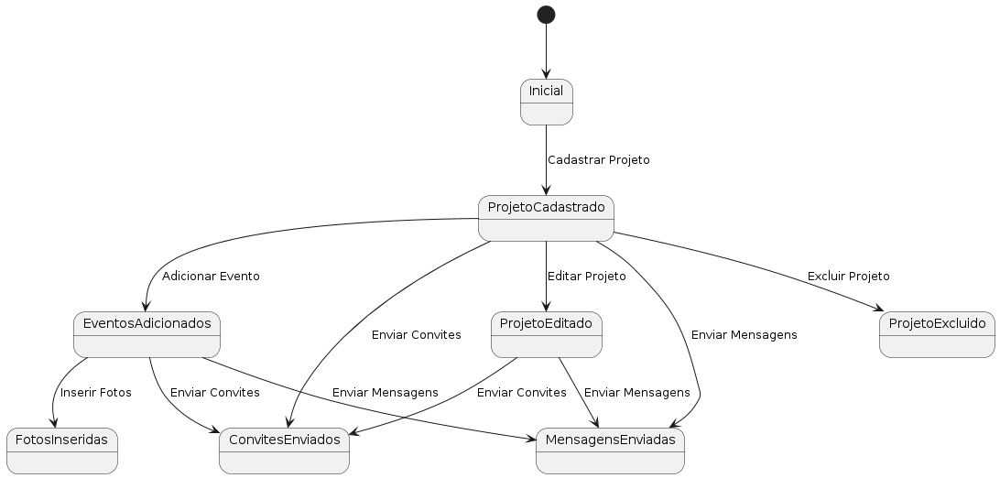
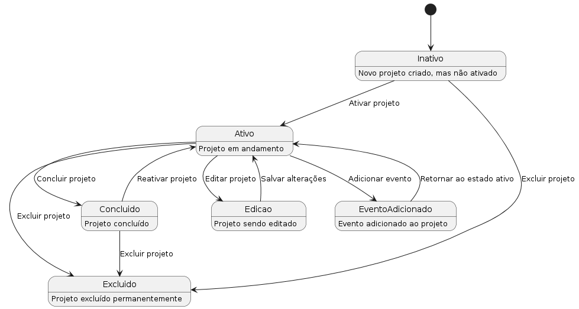

# Diagrama de estado do caso de uso Gerenciamento de Projeto Social

Este repositório contém diagramas e arquivos PlantUML para o caso de uso "Gerenciar Projeto Social".

## Diagramas de Estado

### Diagrama de Estado 1

### Diagrama de Estado 2

## Arquivos PlantUML

### Arquivo PlantUML 1
[Clique aqui para ver o arquivo PlantUML 1](1.puml)

### Arquivo PlantUML 2
[Clique aqui para ver o arquivo PlantUML 2](2.puml)